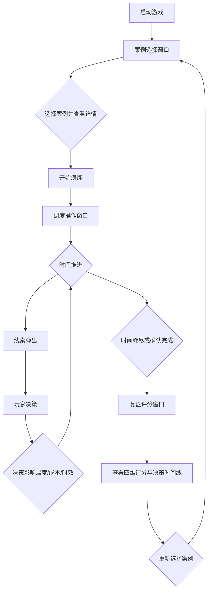

## 1. 产品概述

冷链补冷演练桌面端小游戏，面向新入职调度员和冷链专业学生，通过模拟真实冷链突发事件场景训练应急补冷调度判断能力。玩家在限定时间内做出调度决策，系统从响应速度、温度恢复、资源浪费和沟通完整度四个维度评分并复盘，帮助学员建立系统化的补冷调度思维。

- 解决问题：冷链调度培训依赖实地带教，成本高、场景有限，新人和学生缺少低风险练习环境
- 目标价值：以轻量模拟替代部分实地培训，缩短调度员上岗适应期，降低货损事故率

## 2. 核心功能

### 2.1 用户角色

| 角色 | 进入方式 | 核心权限 |
|------|----------|----------|
| 学员 | 直接进入 | 选择案例、执行调度、查看复盘评分 |
| 管理员 | 密码进入 | 管理案例库、查看学员成绩统计 |

### 2.2 功能模块

1. **案例选择窗口**：场景卡片展示、案例详情预览、温度曲线预览、难度标签
2. **调度操作窗口**：实时温度曲线、倒计时、决策面板（停车/补冷点/干冰/冷库转仓）、资源面板、沟通日志
3. **复盘评分窗口**：四维雷达图评分、决策时间线、错失线索高亮、最优决策对照

### 2.3 页面详情

| 页面名称 | 模块名称 | 功能描述 |
|----------|----------|----------|
| 案例选择 | 场景卡片列表 | 展示疫苗车堵车、海鲜车故障、商超晚点等案例卡片，含缩略温度曲线、货值、难度星级 |
| 案例选择 | 案例详情面板 | 点击卡片展开右侧面板，显示完整温度曲线、剩余里程、天气、可用补冷资源表 |
| 案例选择 | 难度筛选 | 按初级/中级/高级筛选案例 |
| 调度操作 | 实时监控区 | 动态温度曲线图（随时间推进温度变化）、当前温度/目标温度指示器、剩余里程倒计 |
| 调度操作 | 倒计时器 | 顶部居中显示剩余决策时间，最后30秒红色闪烁警告 |
| 调度操作 | 决策面板 | 四个操作选项卡：①是否停车 ②联系补冷点（列表选择）③干冰投放量（滑块）④是否转入临近冷库 |
| 调度操作 | 资源面板 | 显示当前可用干冰库存、附近补冷点距离与容量、冷库剩余位、费用预算 |
| 调度操作 | 沟通日志 | 记录每次调度操作，显示与司机/补冷点/冷库的对话摘要 |
| 调度操作 | 线索提示 | 随时间推进弹出关键线索（天气变化、路况更新等），部分为干扰信息 |
| 复盘评分 | 四维雷达图 | 响应速度/温度恢复/资源浪费/沟通完整度四个维度可视化评分 |
| 复盘评分 | 决策时间线 | 横轴为时间轴，标注每个决策节点、温度变化、线索出现时刻 |
| 复盘评分 | 错失线索 | 红色高亮列出玩家未注意到或未利用的关键线索 |
| 复盘评分 | 最优对照 | 展示专家推荐的最优决策路径，与玩家决策对比差异 |

## 3. 核心流程

玩家进入游戏后首先浏览案例列表，选择一个场景查看详情后开始演练；进入调度操作窗口后，系统实时推进时间线，温度随决策和环境变化，玩家需在限定时间内逐步做出调度决策；时间耗尽或玩家确认完成后进入复盘评分窗口，查看四维评分和详细分析，可返回选择新案例。

## 4. 用户界面设计

### 4.1 设计风格

- **主色调**：深蓝 (#0A1628) + 冰蓝 (#00D4FF) 渐变，体现冷链行业冷感
- **辅助色**：警告橙 (#FF6B35)、安全绿 (#00E676)、危险红 (#FF1744)
- **按钮风格**：圆角8px，冰蓝色主按钮带微光晕效果，次要按钮描边风格
- **字体**：标题用 "Orbitron" 科技感字体，正文用 "Noto Sans SC" 中文清晰可读
- **布局风格**：暗色仪表盘风格，卡片式布局，左侧导航+右侧主内容区
- **图标风格**：线性图标配合冰蓝发光效果，冷链行业相关图标（温度计、雪花、货车）
- **动画**：温度曲线实时绘制动画、决策选项卡悬停微动、倒计时脉动效果、雷达图绘制动画

### 4.2 页面设计概览

| 页面名称 | 模块名称 | UI 元素 |
|----------|----------|---------|
| 案例选择 | 场景卡片列表 | 深色卡片+冰蓝边框，hover放大+发光，缩略温度曲线SVG，难度星级，货值标签 |
| 案例选择 | 案例详情面板 | 右侧滑出面板，完整温度曲线Canvas，资源表格，天气图标，"开始演练"发光按钮 |
| 案例选择 | 难度筛选 | 顶部胶囊按钮组，选中态冰蓝填充 |
| 调度操作 | 实时监控区 | 中央大区域温度曲线Canvas，当前温度数字大号显示，目标温度虚线 |
| 调度操作 | 倒计时器 | 顶部居中圆形倒计时，数字大号Orbitron字体，最后30秒红色脉动 |
| 调度操作 | 决策面板 | 底部四个选项卡式面板，停车开关、补冷点下拉、干冰滑块、冷库转仓按钮 |
| 调度操作 | 资源面板 | 右侧侧边栏，干冰库存进度条、补冷点卡片列表、冷库容量指示 |
| 调度操作 | 沟通日志 | 左下角滚动日志区，对话气泡样式，时间戳 |
| 调度操作 | 线索提示 | 右上角弹出通知卡片，淡入淡出动画，5秒后自动消失 |
| 复盘评分 | 四维雷达图 | 中央Canvas雷达图，冰蓝填充半透明，四个轴标签 |
| 复盘评分 | 决策时间线 | 横向时间轴，节点圆点+连线条，玩家决策蓝点，错失线索红点 |
| 复盘评分 | 错失线索 | 红色背景警告卡片列表，线索描述+影响说明 |
| 复盘评分 | 最优对照 | 双列对比布局，玩家决策vs专家推荐，差异高亮 |

### 4.3 响应式设计

- 桌面优先设计，最小支持 1280×720 分辨率
- 调度操作窗口充分利用宽屏，左中右三栏布局
- 不需要移动端适配（桌面端培训专用）

### 4.4 3D 场景指引

不适用，本项目为2D界面。
