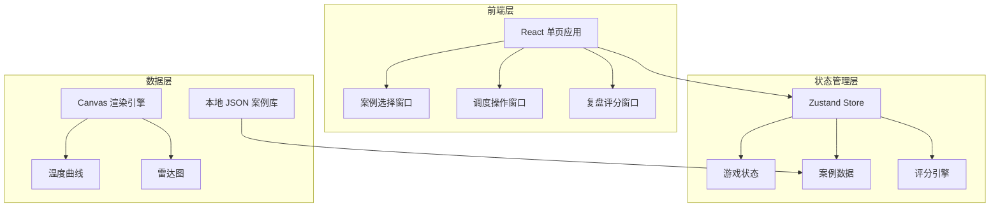
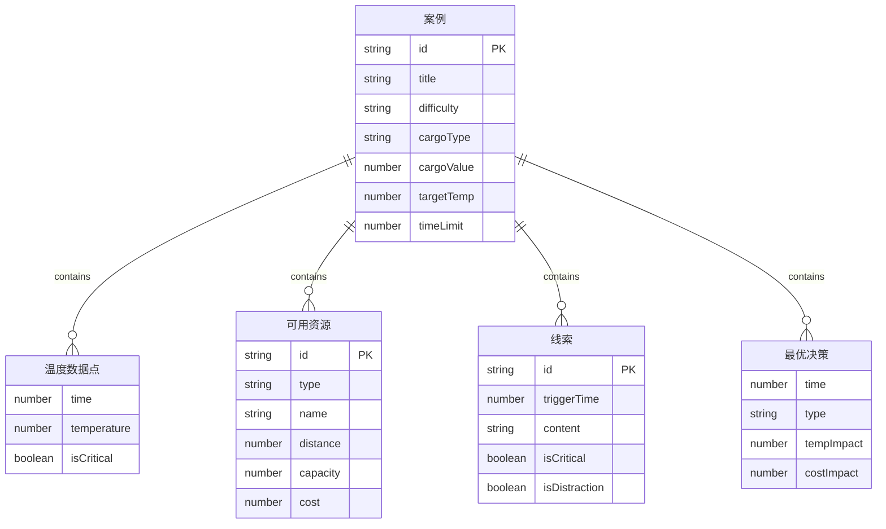

## 1. 架构设计



## 2. 技术说明

- **前端框架**：React@18 + TypeScript + Vite
- **样式方案**：Tailwind CSS@3 + 自定义 CSS 变量
- **状态管理**：Zustand（轻量级，适合单页游戏状态）
- **图表渲染**：Canvas API 手动绘制温度曲线和雷达图（避免重型图表库依赖）
- **动画库**：Framer Motion
- **初始化工具**：Vite
- **后端**：无（纯前端，所有数据本地 JSON）
- **数据库**：无（本地状态管理 + JSON 静态数据）

## 3. 路由定义

| 路由 | 用途 |
|------|------|
| / | 案例选择窗口，默认首页 |
| /dispatch/:caseId | 调度操作窗口，按案例ID加载场景 |
| /review/:caseId | 复盘评分窗口，按案例ID展示评分 |

## 4. API 定义

无后端 API，所有数据为前端本地 JSON。

### 数据接口定义（TypeScript）

```typescript
interface ColdChainCase {
  id: string;
  title: string;
  description: string;
  difficulty: "beginner" | "intermediate" | "advanced";
  cargoType: string;
  cargoValue: number;
  targetTemp: number;
  currentTemp: number;
  remainingMileage: number;
  weather: WeatherInfo;
  availableResources: Resource[];
  temperatureCurve: TempDataPoint[];
  clues: Clue[];
  optimalDecisions: Decision[];
  timeLimit: number;
}

interface WeatherInfo {
  condition: string;
  temperature: number;
  icon: string;
}

interface Resource {
  id: string;
  type: "dry_ice" | "cold_storage" | "recharge_point";
  name: string;
  distance: number;
  capacity: number;
  cost: number;
  available: boolean;
}

interface TempDataPoint {
  time: number;
  temperature: number;
  isCritical: boolean;
}

interface Clue {
  id: string;
  triggerTime: number;
  content: string;
  isCritical: boolean;
  isDistraction: boolean;
  impactOnOptimal: string;
}

interface Decision {
  time: number;
  type: "stop" | "recharge" | "dry_ice" | "cold_storage";
  params: Record<string, any>;
  tempImpact: number;
  costImpact: number;
  timeImpact: number;
}

interface GameScore {
  responseSpeed: number;
  temperatureRecovery: number;
  resourceWaste: number;
  communicationCompleteness: number;
  totalScore: number;
}
```

## 5. 服务器架构图

无服务器架构，纯前端应用。

## 6. 数据模型

### 6.1 数据模型定义



### 6.2 数据定义

使用本地 JSON 文件存储案例数据，位于 `src/data/cases.json`。游戏状态通过 Zustand store 管理，无需数据库 DDL。
